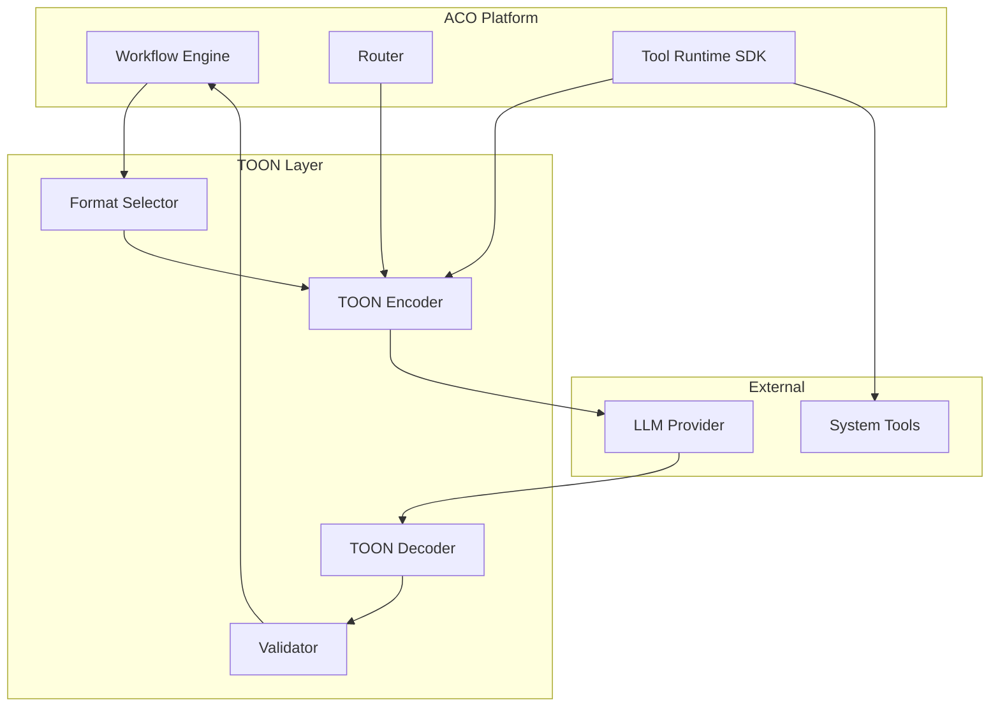
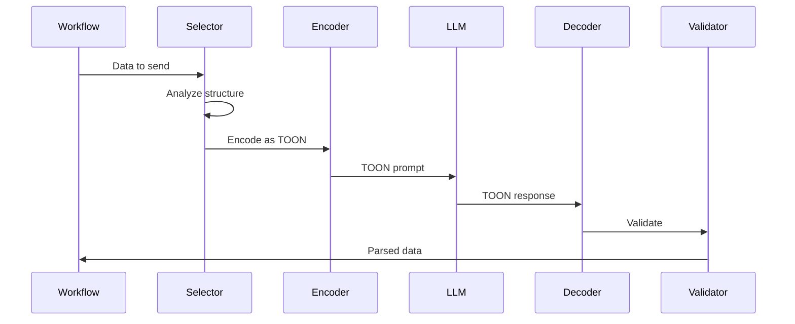

# TOON Integration - Product Requirements Document

**Version:** 1.0  
**Date:** November 2025  
**Owner:** Solutions Architecture Team  
**Project:** Agentic Coding Orchestrator (ACO)  
**Status:** Draft

---

## Executive Summary

**TOON (Token-Oriented Object Notation)** integration into the Agentic Coding Orchestrator (ACO) will reduce LLM token consumption by 30-60% for structured data exchanges while maintaining backward compatibility with existing JSON infrastructure. This PRD defines the requirements for adopting TOON as an optional message format for LLM interactions and high-volume data transfers.

### Key Benefits
- **30-60% token reduction** for tabular and array-heavy data
- **$200-4,000/month cost savings** depending on team size
- **Built-in validation** via explicit array lengths `[N]`
- **Backward compatible** with existing JSON infrastructure

---

## 1. Product Vision

Enable the ACO platform to:

1. **Reduce LLM costs** by 30-60% through efficient token usage
2. **Improve throughput** for data-intensive workflows  
3. **Maintain reliability** with built-in validation via array lengths and strict mode
4. **Provide flexibility** with format selection per workflow/node
5. **Scale efficiently** as workflow complexity grows

---

## 2. Problem Statement

### 2.1 Current Challenges

| Challenge | Impact | Example |
|-----------|---------|---------|
| **High token costs** | JSON repeats field names for every array element | 10 file listings = 500+ tokens |
| **Budget constraints** | Users hit limits 2-3x faster | $500 budget exhausted in 2 weeks |
| **Truncation risks** | Long responses cut off silently | Missing last 20% of results |
| **Inefficient tool responses** | Excessive tokens for simple data | Git status uses 680 tokens for 20 files |

### 2.2 Opportunity Analysis

TOON's tabular format can deliver:
- **Token savings**: 30-60% reduction for uniform structures
- **Validation**: `[N]` counts detect truncation immediately  
- **Cost efficiency**: More operations per dollar
- **Better UX**: Faster responses, lower latency

---

## 3. Core Features

### 3.1 TOON Encoder/Decoder Service

#### Requirements
- Native Rust implementation with `serde` integration
- Full TOON specification compliance
- Bidirectional conversion (Rust structs ↔ TOON)
- Performance target: <5ms for typical payloads

#### Technical Specification
```rust
// Core trait for TOON serialization
pub trait ToonSerializable: Sized {
    fn to_toon(&self, options: ToonOptions) -> Result<String>;
    fn from_toon(toon: &str, options: ToonOptions) -> Result<Self>;
}

// Configuration options
pub struct ToonOptions {
    pub delimiter: Delimiter,      // Comma | Tab | Pipe
    pub key_folding: KeyFolding,   // None | Safe | All
    pub strict: bool,               // Validation mode
    pub indent: usize,              // Spaces per level (default: 2)
    pub flatten_depth: usize,       // Max folding depth
}

// Delimiter options
pub enum Delimiter {
    Comma,      // Default, most compatible
    Tab,        // Best tokenization
    Pipe,       // Alternative when commas/tabs in data
}
```

### 3.2 Message Format Negotiation

#### Dynamic Selection Logic
```rust
pub enum MessageFormat {
    Json,
    Toon(ToonOptions),
    Auto,  // Intelligent selection
}

impl MessageFormatSelector {
    pub fn select(&self, data: &Value) -> MessageFormat {
        match data {
            Value::Array(arr) if arr.len() > 3 && Self::is_uniform(arr) => {
                MessageFormat::Toon(ToonOptions {
                    delimiter: Delimiter::Tab,
                    ..Default::default()
                })
            },
            _ => MessageFormat::Json
        }
    }
}
```

#### Workflow Configuration
```yaml
workflow:
  name: code_analysis
  message_formats:
    llm_input: toon          # Data sent to LLM
    llm_output: toon         # Expected from LLM
    node_to_node: json       # Internal messaging
    tool_responses: auto     # Format based on structure
  toon_options:
    delimiter: tab
    strict: true
    key_folding: safe
```

### 3.3 Tool Response Optimization

#### Automatic Conversion Matrix

| Tool | Response Type | Typical Size | Format | Token Savings |
|------|--------------|--------------|---------|---------------|
| `fs_list` | File arrays | 10-1000 items | TOON | ~50% |
| `git_status` | Change lists | 5-100 files | TOON | ~45% |
| `ast_query` | AST nodes | 20-500 nodes | TOON | ~55% |
| `grep` | Search results | 10-1000 matches | TOON | ~60% |
| `proc_list` | Process data | 5-50 processes | TOON | ~40% |
| `shell_exec` | stdout/stderr | Variable | JSON | 0% |
| `curl` | HTTP response | Single object | JSON | 0% |

### 3.4 LLM Integration

#### Prompt Templates
```rust
pub struct ToonPromptBuilder {
    context: String,
    examples: Vec<String>,
    expected_schema: Option<ToonSchema>,
}

impl ToonPromptBuilder {
    pub fn new() -> Self;
    pub fn with_context(&mut self, ctx: &str) -> &mut Self;
    pub fn with_example(&mut self, data: &impl ToonSerializable) -> &mut Self;
    pub fn expect_output(&mut self, schema: ToonSchema) -> &mut Self;
    pub fn build(&self) -> String;
}

// Usage example
let prompt = ToonPromptBuilder::new()
    .with_context("Analyze these test results")
    .with_example(&sample_results)
    .expect_output(ToonSchema {
        root: "analysis",
        fields: vec!["test_id", "status", "duration_ms", "error"],
        expected_count: Some(10),
    })
    .build();
```

### 3.5 Validation & Error Recovery

#### Validation Pipeline
```rust
pub enum ToonValidationError {
    CountMismatch { 
        header: usize, 
        actual: usize,
        line: usize 
    },
    InvalidDelimiter { 
        expected: char, 
        found: String 
    },
    MalformedHeader(String),
    IndentationError { 
        line: usize, 
        expected: usize, 
        actual: usize 
    },
    UnterminatedQuote { line: usize },
    InvalidEscape { sequence: String, line: usize },
}

pub struct ToonValidator {
    strict: bool,
    auto_repair: bool,
    max_repair_attempts: usize,
}

impl ToonValidator {
    pub fn validate(&self, input: &str) -> Result<(), Vec<ToonValidationError>>;
    pub fn validate_and_decode(&self, input: &str) -> Result<Value, ToonValidationError>;
    pub fn attempt_repair(&self, input: &str) -> Option<(String, Vec<RepairAction>)>;
}
```

### 3.6 Budget Impact Analytics

#### Cost Tracking
```rust
pub struct FormatMetrics {
    pub format: MessageFormat,
    pub json_tokens: usize,
    pub toon_tokens: usize,
    pub savings_percent: f64,
    pub cost_saved_usd: f64,
    pub timestamp: DateTime<Utc>,
}

pub struct BudgetAnalyzer {
    pricing: LlmPricing,
    history: Vec<FormatMetrics>,
}

impl BudgetAnalyzer {
    pub fn analyze_message(&mut self, data: &Value) -> FormatMetrics;
    pub fn recommend_format(&self, data: &Value) -> MessageFormat;
    pub fn calculate_savings(&self, period: Duration) -> BudgetSavings;
    pub fn generate_report(&self) -> BudgetReport;
}
```

---

## 4. Implementation Roadmap

### Phase 1: Foundation (Weeks 1-2)
- [x] Finalize TOON specification review
- [ ] Implement core encoder/decoder in Rust
- [ ] Create `serde` integration layer
- [ ] Unit test coverage >90%
- [ ] Benchmark against reference implementation

**Deliverables:**
- `toon-rs` crate with core functionality
- Performance benchmarks
- Test suite

### Phase 2: Tool Integration (Weeks 3-4)
- [ ] Integrate with Tool Runtime SDK
- [ ] Implement auto-format selection
- [ ] Update high-volume tools
- [ ] Create format conversion utilities
- [ ] Integration testing suite

**Deliverables:**
- Updated Tool Runtime SDK
- Format selection engine
- Integration tests

### Phase 3: LLM Bridge (Weeks 5-6)
- [ ] Prompt template system
- [ ] LLM output validators
- [ ] Error recovery mechanisms
- [ ] A/B testing framework
- [ ] Performance profiling

**Deliverables:**
- LLM integration module
- Validation framework
- A/B test results

### Phase 4: Advanced Features (Weeks 7-8)
- [ ] Multiple delimiter support
- [ ] Key folding implementation
- [ ] Custom schema definitions
- [ ] Format recommendation ML model
- [ ] Caching layer

**Deliverables:**
- Complete feature set
- ML recommendation engine
- Performance optimizations

### Phase 5: Production Readiness (Weeks 9-10)
- [ ] Monitoring dashboard
- [ ] Alert system
- [ ] Documentation
- [ ] Migration tools
- [ ] Training materials

**Deliverables:**
- Production deployment
- Monitoring suite
- Complete documentation

---

## 5. Success Metrics

### 5.1 Primary KPIs

| Metric | Target | Measurement |
|--------|---------|------------|
| **Token Reduction** | ≥30% average | Compare same data JSON vs TOON |
| **Cost Savings** | ≥25% reduction | Monthly LLM API costs |
| **Parse Success Rate** | ≥95% | Successful TOON parsing from LLMs |
| **Performance Overhead** | <5ms | TOON conversion time |
| **Adoption Rate** | 50% in 30 days | Workflows using TOON |

### 5.2 Secondary Metrics

- **Error Rate**: <2% increase in parsing failures
- **User Satisfaction**: >4.0/5.0 rating
- **Throughput**: 20% more operations per dollar
- **Latency**: 10% reduction in response time
- **Budget Utilization**: 40% improvement

---

## 6. Risk Analysis & Mitigation

| Risk | Probability | Impact | Mitigation Strategy |
|------|------------|---------|-------------------|
| **LLM generates invalid TOON** | Medium (40%) | High | • Strict validation<br>• Fallback to JSON<br>• Repair algorithms |
| **Performance degradation** | Low (15%) | Medium | • Profiling<br>• Caching<br>• Optimize hot paths |
| **User adoption resistance** | Medium (30%) | Medium | • Clear documentation<br>• Migration tools<br>• Gradual rollout |
| **Breaking changes** | Low (10%) | High | • Versioning<br>• Backward compatibility<br>• Feature flags |
| **Debugging complexity** | Medium (35%) | Low | • Dual-format logging<br>• Conversion tools<br>• Debug mode |

---

## 7. Technical Architecture

### 7.1 Component Diagram


### 7.2 Data Flow


---

## 8. Configuration Specifications

### 8.1 Global Configuration
```toml
[toon]
enabled = true
default_format = "auto"
fallback = "json"

[toon.defaults]
delimiter = "\t"
indent = 2
strict = true
key_folding = "safe"
flatten_depth = 3

[toon.validation]
max_repair_attempts = 3
auto_repair = true
log_failures = true

[toon.monitoring]
track_savings = true
report_interval = 3600
alert_threshold = 0.1
```

### 8.2 Per-Workflow Override
```yaml
workflow:
  id: code_review_pipeline
  
  format_strategy:
    default: auto
    overrides:
      - node: file_analyzer
        format: toon
        options:
          delimiter: tab
          strict: true
      
      - node: complexity_calculator
        format: json  # Complex nested structure
      
      - node: report_generator
        format: toon
        options:
          key_folding: all
```

---

## 9. API Reference

### 9.1 Core APIs
```rust
// Encoding
pub fn encode<T: Serialize>(value: &T, options: ToonOptions) -> Result<String, ToonError>;

// Decoding  
pub fn decode<T: DeserializeOwned>(input: &str, options: ToonOptions) -> Result<T, ToonError>;

// Validation
pub fn validate(input: &str, strict: bool) -> Result<(), Vec<ValidationError>>;

// Format recommendation
pub fn recommend_format(data: &Value, context: FormatContext) -> MessageFormat;

// Cost calculation
pub fn calculate_savings(json: &str, toon: &str, pricing: &LlmPricing) -> FormatMetrics;
```

### 9.2 Integration Points
```rust
// Tool Runtime SDK
impl ToolResponse {
    pub fn encode(&self, format: MessageFormat) -> String;
    pub fn decode(input: &str, format: MessageFormat) -> Result<Self>;
}

// LLM Module
impl LlmClient {
    pub async fn complete_with_format(
        &self, 
        prompt: &str, 
        format: MessageFormat
    ) -> Result<String>;
}

// Workflow Engine
impl WorkflowNode {
    pub fn set_message_format(&mut self, format: MessageFormat);
    pub fn get_format_metrics(&self) -> FormatMetrics;
}
```

---

## 10. Testing Strategy

### 10.1 Test Coverage Requirements

| Component | Unit Tests | Integration Tests | E2E Tests |
|-----------|------------|-------------------|-----------|
| Encoder/Decoder | >95% | >90% | >80% |
| Validator | >90% | >85% | >75% |
| Format Selector | >85% | >80% | >70% |
| LLM Integration | >80% | >85% | >80% |

### 10.2 Test Scenarios
- **Correctness**: Round-trip encoding/decoding
- **Performance**: Benchmark vs JSON
- **Validation**: Invalid TOON handling
- **LLM Output**: Parse success rates
- **Error Recovery**: Repair algorithms
- **Edge Cases**: Empty arrays, deep nesting, special characters

---

## 11. Documentation Requirements

### 11.1 User Documentation
- [ ] TOON Format Guide
- [ ] Migration Guide from JSON
- [ ] Best Practices
- [ ] FAQ
- [ ] Video tutorials

### 11.2 Developer Documentation
- [ ] API Reference
- [ ] Integration Guide
- [ ] Performance Tuning
- [ ] Troubleshooting
- [ ] Contributing Guide

### 11.3 Operations Documentation
- [ ] Deployment Guide
- [ ] Monitoring Setup
- [ ] Alert Configuration
- [ ] Incident Response
- [ ] Capacity Planning

---

## 12. Cost-Benefit Analysis

### 12.1 Development Costs
- **Engineering**: 2 developers × 10 weeks = 20 person-weeks
- **Testing**: 1 QA × 4 weeks = 4 person-weeks
- **Documentation**: 1 technical writer × 2 weeks = 2 person-weeks
- **Total**: ~26 person-weeks

### 12.2 Expected Savings (Monthly)

| Team Size | Current LLM Cost | Expected Savings | ROI Period |
|-----------|------------------|------------------|------------|
| Small (5 users) | $1,000 | $200-400 | 3-6 months |
| Medium (20 users) | $4,000 | $800-1,500 | 2-3 months |
| Large (50+ users) | $10,000 | $2,000-4,000 | 1-2 months |

### 12.3 Additional Benefits
- **Improved throughput**: 20-40% more workflows per budget
- **Better reliability**: Validation catches truncation
- **Future-proofing**: Ready for more expensive models
- **Competitive advantage**: Lower operational costs

---

## 13. Decision Log

| Date | Decision | Rationale | Alternatives Considered |
|------|----------|-----------|------------------------|
| 2025-11-15 | Native Rust implementation | Performance, no FFI overhead | JavaScript FFI, Go implementation |
| 2025-11-16 | Tab as default delimiter | Best tokenization efficiency | Comma (compatibility), Pipe (clarity) |
| 2025-11-17 | Opt-in deployment | Reduce risk, gradual adoption | Mandatory migration, Dual-stack |
| 2025-11-18 | Strict validation default | Catch errors early | Lenient mode, Auto-repair |

---

## 14. Appendices

### Appendix A: Token Analysis Data

#### Sample Tool Responses
```toon
# File listing (50 files)
files[50]{path,size,modified}:
  src/main.rs,1024,2025-01-15T10:00:00Z
  src/lib.rs,2048,2025-01-14T09:30:00Z
  ... (48 more rows)

# Token count: 520 (vs 1,250 in JSON)
```

### Appendix B: LLM Compatibility

| Model | TOON Generation | Success Rate | Notes |
|-------|-----------------|--------------|-------|
| GPT-4 | Excellent | 96% | Handles all features |
| Claude-3 | Excellent | 95% | Best with explicit headers |
| GPT-3.5 | Good | 88% | Occasional delimiter issues |
| Llama-3 | Good | 85% | Needs clear examples |
| Local models | Fair | 75% | Requires fine-tuning |

### Appendix C: Performance Benchmarks

| Operation | Data Size | JSON Time | TOON Time | Speedup |
|-----------|-----------|-----------|-----------|---------|
| Encode | 100 rows | 1.2ms | 0.8ms | 1.5x |
| Decode | 100 rows | 0.9ms | 1.1ms | 0.82x |
| Validate | 100 rows | N/A | 0.3ms | - |
| Round-trip | 100 rows | 2.1ms | 2.2ms | 0.95x |

---

## 15. Approval & Sign-off

| Role | Name | Signature | Date |
|------|------|-----------|------|
| Product Owner | | | |
| Technical Lead | | | |
| Engineering Manager | | | |
| QA Lead | | | |
| Operations Lead | | | |

---

**Document Status:** Draft  
**Next Review:** [Date]  
**Distribution:** Engineering, Product, Operations